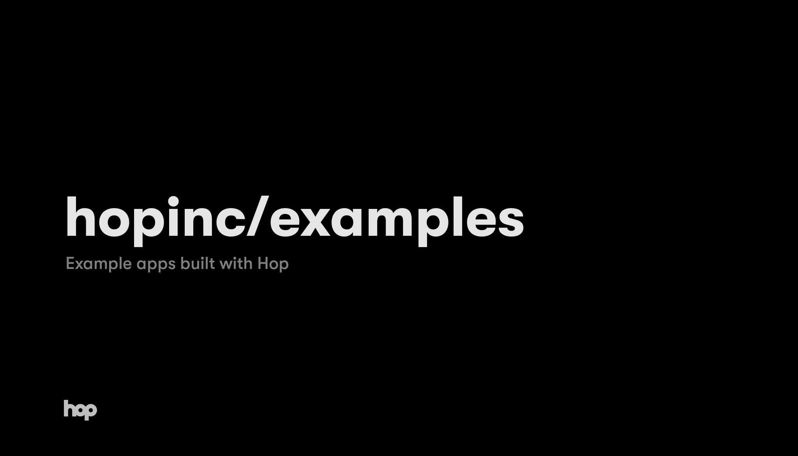

This repo houses a few examples of apps built with Hop products. All apps can be deployed directly to Hop with the CLI by running `$ hop deploy`

### Apps

- [next-chat-app](./js/next-chat-app): A simple chat app built with Channels and Next.js API Routes.
- [deno-with-sdk](./js/deno-with-sdk): Fetch a list of your deployments with Deno and the Hop SDK.
